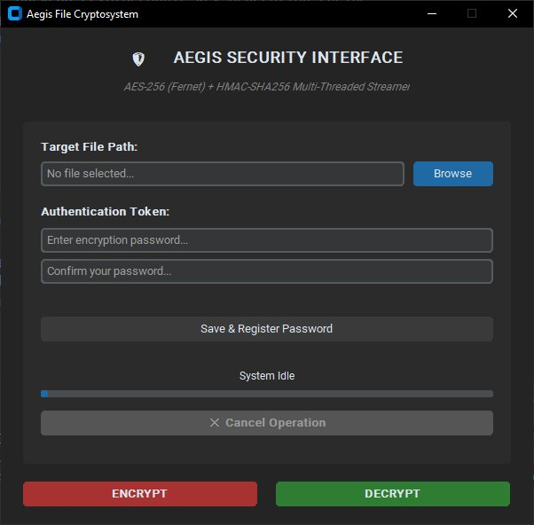

<div align="center">

# 🛡️ Aegis File Cryptosystem

### AES-256 Encryption & Decryption Tool with HMAC Integrity Verification

[](https://www.python.org/)
[](https://cryptography.io/)
[](https://github.com/p-h-c/phc-winner-argon2)
[](https://en.wikipedia.org/wiki/HMAC)
[](LICENSE)

<br/>

**Aegis** is a desktop file encryption/decryption application built with Python. It combines **AES-256 (Fernet)** symmetric encryption, **Argon2id** key derivation, and **HMAC-SHA256** integrity verification — all wrapped in a modern dark-themed GUI powered by **CustomTkinter**.

<br/>

[Getting Started](#-getting-started) •
[Features](#-features) •
[How It Works](#-how-it-works) •
[Tech Stack](#-tech-stack) •
[Project Structure](#-project-structure) •
[Contributing](#-contributing)

</div>

---

## ✨ Features

| Feature | Description |
|---|---|
| 🔐 **AES-256 Encryption** | Military-grade symmetric encryption via Python's `cryptography` Fernet implementation |
| 🧬 **Argon2id Key Derivation** | Memory-hard, GPU-resistant password hashing (time_cost=3, memory=64MB, parallelism=2) |
| 🔏 **HMAC-SHA256 Integrity** | Streaming hash-based message authentication to detect tampering or corruption |
| 📂 **File-Based Operations** | Encrypt and decrypt any file type — documents, images, archives, and more |
| 🧵 **Multi-Threaded Processing** | Background threading keeps the UI responsive during heavy cryptographic operations |
| 💾 **Chunked Streaming** | Processes files in 64KB chunks to prevent RAM overflow on large files |
| 🎨 **Modern UI** | Sleek CustomTkinter interface with dark mode and intuitive layout |
| 📦 **Standalone Executable** | PyInstaller-ready — build a single `.exe` for distribution |

---

## 🖥️ UI Preview

<div align="center">



*The Aegis Security Interface — dark-themed desktop GUI running as a standalone `.exe`*

</div>

---

## 🚀 Getting Started

### Prerequisites

- **Python 3.10** or higher
- **pip** package manager

### Installation

1. **Clone the repository**

   ```bash
   git clone https://github.com/abdofarissi/Cybersecurity.git
   cd Cybersecurity
   ```

2. **Install dependencies**

   ```bash
   pip install customtkinter cryptography argon2-cffi pycryptodome
   ```

3. **Run the application**

   ```bash
   python main.py
   ```

### Build Standalone Executable (Optional)

To easily generate a standalone Windows executable (`.exe`) with the custom icon, simply run the included batch script:

1. Double-click the **`build.bat`** file in the project folder.
2. Wait for the process to finish.
3. Your compiled `Aegis_Crypto.exe` application will be available in the **`dist/`** directory!


## 🔧 How It Works

```
┌──────────────────────────────────────────────────────────────────┐
│                      ENCRYPTION FLOW                             │
├──────────────────────────────────────────────────────────────────┤                                                                                                                                
│  Password ──► Argon2id(salt⊕0xFF) ──► HMAC Key                  │
│  Password ──► Argon2id(salt) ──► 256-bit Key ──► Fernet Key      │                                                                    
│                                                                  │
│  Plaintext File                                                  │
│       │                                                          │
│       ▼                                                          │
│  ┌─────────┐    ┌──────────────┐    ┌──────────────────┐         │
│  │ 64KB    │───►│ Fernet       │───►│ Encrypted Chunk  │         │
│  │ Chunks  │    │ Encrypt      │    │ + HMAC Update    │         │
│  └─────────┘    └──────────────┘    └──────────────────┘         │
│                                             │                    │
│                                             ▼                    │
│                          ┌──────────────────────────────┐        │
│                          │  salt(16B) ‖ ciphertext ‖    │        │
│                          │  HMAC-SHA256(32B)            │        │
│                          └──────────────────────────────┘        │
│  ┌─────────┐    ┌──────────────┐    ┌──────────────────┐         │
│  │ 64KB    │───►│ Fernet       │───►│ Encrypted Chunk  │         │
│  │ Chunks  │    │ Encrypt      │    │ + HMAC Update    │         │
│  └─────────┘    └──────────────┘    └──────────────────┘         │
│                                             │                    │
│                                             ▼                    │
│                          ┌──────────────────────────────┐        │
│                          │  salt(16B) ‖ ciphertext ‖    │        │
│                          │  HMAC-SHA256(32B)            │        │
│                          └──────────────────────────────┘        │
│                                    .enc file                     │
└──────────────────────────────────────────────────────────────────┘
```

### Step-by-Step

1. **Key Derivation** — A random 16-byte salt is generated. The user's password is fed through **Argon2id** to produce a 256-bit encryption key (for Fernet) and a separate HMAC key (derived using a XOR-flipped salt).

2. **Encryption** — The file is read in **64KB streaming chunks**. Each chunk is encrypted with **AES-256 (Fernet)**. The encrypted output is simultaneously fed into the **HMAC-SHA256** computation.

3. **Output Format** — The encrypted file (`.enc`) is structured as:
   ```
   [ 16-byte salt ] [ encrypted data ] [ 32-byte HMAC signature ]
   ```

4. **Decryption** — The salt is extracted from the file header, the HMAC signature from the footer. The password re-derives both keys. HMAC integrity is verified **before** decryption proceeds — if the signature doesn't match, the process is aborted.

---

## 🔒 Cryptographic Specifications

| Parameter | Value |
|---|---|
| **Encryption Algorithm** | AES-256-CBC (via Fernet) |
| **Key Derivation Function** | Argon2id |
| **KDF Time Cost** | 3 iterations |
| **KDF Memory Cost** | 65,536 KB (64 MB) |
| **KDF Parallelism** | 2 threads |
| **Key Length** | 256 bits (32 bytes) |
| **Salt Length** | 128 bits (16 bytes) |
| **Integrity Check** | HMAC-SHA256 |
| **HMAC Digest Size** | 256 bits (32 bytes) |
| **Chunk Size** | 64 KB (streaming) |

---

## 🛠 Tech Stack

| Technology | Purpose |
|---|---|
| [**Python 3.10+**](https://www.python.org/) | Core language |
| [**CustomTkinter**](https://github.com/TomSchimansky/CustomTkinter) | Modern themed GUI framework |
| [**cryptography**](https://cryptography.io/) | AES-256 Fernet encryption/decryption |
| [**argon2-cffi**](https://github.com/hynek/argon2-cffi) | Argon2id password key derivation |
| [**PyCryptodome**](https://www.pycryptodome.org/) | HMAC-SHA256 integrity verification |
| [**PyInstaller**](https://pyinstaller.org/) | Standalone executable packaging |

---

## 📁 Project Structure

```
Cybersecurity/
├── main.py                # Application entry point & GUI
├── HMAC_integrity.py      # HMAC-SHA256 streaming integrity module
├── main.spec              # PyInstaller build configuration
├── icon.ico               # Application icon
├── Encrypted/             # Sample encrypted files (.enc)
│   ├── clé.txt.enc
│   └── movies.txt.enc
├── build/                 # PyInstaller build artifacts
├── dist/                  # Compiled executable output
└── README.md
```

---

## 📖 Usage

### Encrypting a File

1. Launch the application (`python main.py`)
2. Click **Browse** to select the target file
3. Enter and confirm your encryption password
4. Click **Encrypt** — the output `.enc` file is saved in a directory chosen by the user.

### Decrypting a File

1. Launch the application
2. Click **Browse** to select an `.enc` file
3. Enter the same password used during encryption
4. Click **Decrypt** — integrity is verified via HMAC before the file is restored

> ⚠️ **Important**: If the HMAC verification fails, the file may have been tampered with or the wrong password was provided. Decryption will be aborted to protect data integrity.

---

## 🤝 Contributing

Contributions are welcome! Here's how to get started:

1. **Fork** the repository
2. **Create** a feature branch (`git checkout -b feature/amazing-feature`)
3. **Commit** your changes (`git commit -m 'Add amazing feature'`)
4. **Push** to the branch (`git push origin feature/amazing-feature`)
5. **Open** a Pull Request

### Ideas for Contribution

- [ ] Add support for folder/batch encryption
- [ ] Implement a password strength meter in the UI
- [ ] Add drag-and-drop file selection
- [ ] Create a progress bar for large file operations
- [ ] Add a file shredder (secure delete after encryption)

---

## 📜 License

This project is open source and available under the [MIT License](LICENSE).

---

## 👥 Team

This project was collaboratively developed by a four-member team as part of a cybersecurity academic project.

| Member | Role | Contributions |
|---|---|---|
| **Abderrahmane Farissi** <br/> [@abdofarissi](https://github.com/abdofarissi) | 🔐 Encryption & Decryption Engineer | Implemented the core encryption and decryption logic using Fernet (AES-256); developed the primary cryptographic functions; connected file I/O handling to the main application pipeline; integrated HMAC security into the encryption flow; primary GitHub contributor and project maintainer |
| **Khawla Moutawakkil** <br/> [@khawlamoutawakkil](https://github.com/khawlamoutawakkil) | 🎨 UI/UX Designer | Designed the application's user interface and overall user experience; responsible for the CustomTkinter theme layout, widget arrangement, and visual consistency of the desktop GUI |
| **Saif Eddine Zaoui** | 🔏 HMAC Integration Engineer | Led the integration of the HMAC-SHA256 integrity verification layer; developed the `HMAC_integrity.py` module responsible for streaming message authentication and tamper detection during both encryption and decryption |
| **Meriem Saber** | 🛡️ Vulnerability Tester & Documentation Writer | Conducted security testing to identify potential vulnerabilities in the cryptographic pipeline and application logic; contributed to writing the project summary and technical documentation |

---

<div align="center">

**If you find this project useful, please consider giving it a ⭐**

Made with 🔐 and ❤️ by the Aegis team

</div>
